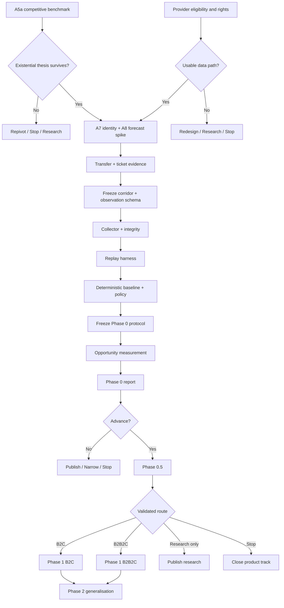

# AnschlussPilot Roadmap

> **Disruption-aware journey decision support for German rail.**
>
> This roadmap describes the order in which AnschlussPilot should remove
> uncertainty. It is **not a release-date commitment** and it is **not a feature
> backlog**.
>
> Canonical product reasoning lives in [`README.md`](README.md), engineering
> invariants in [`AGENTS.md`](AGENTS.md), and detailed protocols in [`docs/`](docs/).
> Where this roadmap conflicts with a frozen protocol or an active decision in
> [`docs/decisions.md`](docs/decisions.md), the canonical artefact wins.

---

## 1. Roadmap Principle

AnschlussPilot is an evidence-gated project.

Progress is measured primarily by **uncertainty removed**, not by lines of code,
features shipped, models trained, or screens built.

The project advances only when the evidence required for the next stage exists.

```text
Does the product gap exist?
        ↓
Can the required data be obtained and retained?
        ↓
Can service runs be reconstructed reliably?
        ↓
Can the counterfactual decision be measured?
        ↓
Does the policy materially improve journey outcomes?
        ↓
Will a person understand and act on the recommendation?
        ↓
Which distribution route is viable?
        ↓
Only then: build a distributable product
```

This ordering is intentional.

A technically sophisticated application built before these questions are
answered would increase sunk cost without reducing the project's principal risks.

---

## 2. Current State

**Phase:** `0 — Research / Product-Thesis Validation`, executing as
**Phase 0-lite** (D052).

**Repository state:** documentation only.

> [!IMPORTANT]
> **Phase 0-lite — scope and claim (D052, 2026-09-03).**
> Milestones P0-A through P0-G below are executed at reduced scope: **one
> transfer station, one daily window of about four hours, 30–60 consecutive
> operating days**, on a published-licence feed, using the forecast-only decisive
> signal ([`docs/decisive-signal-analysis.md`](docs/decisive-signal-analysis.md))
> and D051's reduced A3 / A6 prerequisites.
>
> **Every Phase 0-lite output carries the label `DIRECTIONAL — NOT
> CONFIRMATORY`.** `S2` and `S10` are directional gates here: clearing S2 does
> not establish the opportunity, it justifies funding **Phase 0-full**; firing S2
> is not a stop on its own, because the interval will often be too wide to
> exclude the threshold. The report must say which of those it is. **S8** still
> governs stopping, on the original 24-month clock.

> [!WARNING]
> **Sequencing rule (D052).** Episodes accrue on wall-clock time
> ([`docs/modelling-and-evaluation.md`](docs/modelling-and-evaluation.md) §2), so
> **collection time is the only irreplaceable input in this project** — D037's
> pre-report gate already names it as such. It has been spent at zero yield for
> the whole of Phase 0 so far.
>
> Therefore: **the A7 + A8 spike and the minimal collector outrank every
> remaining documentation item**, including protocol-manifest fields that do not
> gate collection. Documentation work that can be done during a running
> collection window must not be done instead of starting one.

Not yet present:

- application code;
- provider integration;
- observation collector;
- retained dataset;
- replay infrastructure;
- decision engine implementation;
- tests;
- trained statistical or ML models;
- deployed service;
- user interface.

Current evidence state:

| Area | State |
| --- | --- |
| Product thesis | Defined |
| Engineering invariants | Defined |
| Phase 0 measurement methodology | Defined, but freeze manifest incomplete |
| Phase 0 protocol manifest | `BLOCKED` |
| A5a competitive benchmark | Initial D046 run remains `inconclusive / BLOCKED` at `0/5` and `0/15`; v2 is running after its first fixed-order sweep produced no included case and remains `0/5`, `0/15` |
| Provider capability mapping | `v4-partial`; all three enquiries received a response, but DELFI answered 0/6 original questions and no usable provider path is established |
| Provider rights / retention gate | `BLOCKED` |
| A2c decisive-signal access | `UNKNOWN` |
| A3c transfer-data access | `UNKNOWN` |
| A4 storage rights | `UNKNOWN` |
| Decisive-signal definition (D049a) | **Closed 2026-09-03** — forecast-only estimator separates `CONTINUE` from `REROUTE_EARLY` outside a bounded hold band; D049's reversal condition did not trigger. See [`docs/decisive-signal-analysis.md`](docs/decisive-signal-analysis.md) |
| A8 forecast informativeness | **Opened 2026-09-03**, untested. Load-bearing consequence of the line above; scored against **S13**; runs with the A7 spike |
| A7 + A8 spike | Not started; **no longer blocked by the provider gate** — a published-licence route exists (D049, D050), pending a full licence read. **Highest-priority item in Phase 0** (D052) |
| Corridor scope | `UNSET` |
| Observation schema | `UNSET` |
| Collector | Not started |
| Replay harness | Not started |
| Deterministic baseline | Not implemented / not frozen |
| Phase 0 measurement | Not started |
| Phase 0.5 user validation | Not started |
| Commercial route | Undecided |

The immediate objective is therefore **not to begin product development**.

The immediate objective is to remove the cheapest existential uncertainties.

---

# 3. Phase 0 — Can We Make a Useful Decision?

**Purpose:** determine whether the intervention thesis survives contact with real
railway data.

**Primary output:** a reproducible Phase 0 report.

**Product output:** none.

**UI:** none.

**Primary gate:** evidence, not implementation completeness.

---

## 3.1 Milestone P0-A — Cheap Existential Checks

### Goal

Kill, narrow, or redirect the project before expensive infrastructure is built if
the core opportunity or required data access does not exist.

### Work

- [x] Run the first **A5a live competitive benchmark** — initial D046 run
      closed `inconclusive / BLOCKED` at `0/5` complete cases and `0/15` scored
      observations; a later run requires a new pre-registered denominator.
- [x] Pre-register the separate Phase 0A v2 denominator after all three
      anonymous app entries passed physical-device setup preflight; v2 imports
      no v1 evidence.
- [x] Complete the first v2 fixed-order station sweep; eight representative
      discovery queries produced no included case, so no app observation window
      opened and the v2 counts remain `0/5`, `0/15`.
- [ ] Evaluate the fixed disruption archetypes against current live products.
- [ ] Record screenshots, interaction count, elapsed time, product state and
      sample completeness.
- [ ] Determine whether an existing product already performs a
      decision-grade continue-vs-change comparison.
- [ ] Complete the currently prepared **zero-budget provider enquiries** — all
      three received a response, but DELFI requested project context instead of
      answering the original six questions; its written project-context reply
      was sent 2026-08-26 and awaits a substantive answer.
- [ ] Obtain written evidence on eligibility for relevant DB / public-data
      products and streams — the received DB replies close individual
      zero-budget paths but leave RiFahrt and downstream rights `UNKNOWN`.
- [ ] Resolve, where possible:
  - [ ] A2c — access to connection-hold / dispatch information;
  - [ ] A3c — access to sufficiently precise transfer information;
  - [ ] A4 — storage and retention rights;
  - [ ] redistribution rights;
  - [ ] research / derived-analysis rights;
  - [ ] commercial-use rights;
  - [ ] attribution obligations;
  - [ ] access continuity / termination conditions.
- [ ] Preserve unresolved questions as `UNKNOWN`; do not infer permission from
      technical availability.

### Exit

Advance only when either:

1. an obtainable data path with sufficient Phase 0 rights has been identified; or
2. the project has explicitly chosen a documented weaker research design.

Relevant stop / redirect conditions include `S1`, `S6`, `S11`, and `S12` in
`README.md`.

### Explicitly not in scope

- provider integration;
- collector implementation;
- database design beyond what is needed to evaluate terms;
- frontend work;
- ML;
- paid provider access without a new recorded decision.

---

## 3.2 Milestone P0-B — Establish the Experimental Contract

### Goal

Freeze the pieces that would make later observations interpretable.

Once longitudinal collection begins, missing scope and missing fields cannot be
recovered retroactively.

### Work

#### Provider contract

- [ ] Select the Phase 0 provider or provider combination.
- [ ] Freeze a provider-rights snapshot.
- [ ] Define permitted raw-payload handling.
- [ ] Define retention policy.
- [ ] Define attribution requirements.
- [ ] Define any deletion requirement.
- [ ] Record rate limits and intended polling cadence.

#### Service identity and forecast informativeness — A7 + A8

> **Lawful route, recorded 2026-09-02 (D049, D050).** This spike is the highest-
> value unblocked item in Phase 0, and it does **not** require a provider
> relationship. It must not be run on "any available feed": **I15** and **D044**
> forbid fetching or retaining before rights are established. The route is:
> read the `gtfs.de` licence and terms in full — summary pages are not terms —
> and only if fetch plus temporary retention are permitted, run the spike on
> that feed. Score against **S9** (> 5 %); do not invent a new threshold.
> See [`docs/provider-evaluation.md`](docs/provider-evaluation.md) §2.4.

> **A8 rides on the same spike (added 2026-09-03).** The same poll that tests
> identity linkage also captures forecast times and, later in the window, the
> realised arrivals to compare them against. Running A8 separately would pay the
> licence read, the polling setup and the observation window twice. A8 is scored
> against **S13**; **do not invent a new threshold.** See
> [`docs/decisive-signal-analysis.md`](docs/decisive-signal-analysis.md) §6.

- [ ] Read the candidate feed's licence and terms in full; record the result.
- [ ] Run the bounded identity-resolution spike.
- [ ] Poll one corridor segment for the planned observation period.
- [ ] Attempt to link service runs across consecutive observations.
- [ ] Quantify failed and ambiguous linkage.
- [ ] Investigate every systematic ambiguity class.
- [ ] Redesign the identity strategy if necessary.
- [ ] **A8:** retain forecast arrival times at the 20 / 30 / 40 min horizons and
      the realised arrival for each observed run.
- [ ] **A8:** report the forecast-minus-realised error *distribution* per horizon
      — median bias and inter-quartile range, never a point estimate.
- [ ] **A8:** score against `S13`; if it fires, narrow horizons or service classes
      and re-run before concluding.

**Gate:** do not build longitudinal analysis on an identity mechanism whose
failure / ambiguity rate violates `S9`, **or on a forecast whose error violates
`S13` at the horizons where `REROUTE_EARLY` is actionable.**

#### Transfer evidence — A3

- [ ] Establish the actual source of `T_transfer`.
- [ ] Determine available precision.
- [ ] Determine whether platform-pair or topology information is obtainable.
- [ ] Establish explicit fallback intervals where precision is unavailable.

#### Ticket-binding scenarios — A6

- [ ] Verify applicable carrier / issuer conditions using current authoritative
      sources.
- [ ] Freeze the rules used for `BOUND` and `UNBOUND` analysis.
- [ ] Version [`docs/binding-scenarios.md`](docs/binding-scenarios.md).

#### Corridor sizing

- [ ] Record actual hours available per week.
- [ ] Record the acceptable Phase 0 calendar ceiling.
- [ ] Select one corridor only.
- [ ] Shrink stations, service classes and observation windows until the estimated
      Phase 0 work fits within **half** of the calendar ceiling.
- [ ] Verify that the resulting scope can still produce enough independent
      disruption episodes for meaningful evaluation.

#### Observation contract

- [ ] Freeze corridor scope `v1`.
- [ ] Freeze polling cadence.
- [ ] Freeze observation schema `v1`.
- [ ] Define missing-value semantics.
- [ ] Define scheduled, provider, event-effective, ingestion and decision times
      separately.
- [ ] Define provenance fields.
- [ ] Define freshness semantics.
- [ ] Define explicit gap records.

### Exit

The collector gate in
[`docs/phase0-protocol.md`](docs/phase0-protocol.md) must be satisfied.

No collector implementation is considered useful progress before this contract is
defensible.

---

## 3.3 Milestone P0-C — Observation and Replay Foundation

### Goal

Create the smallest infrastructure capable of reconstructing:

> **What could AnschlussPilot legitimately have known at decision time `t`?**

This is the technical foundation of the entire project.

### Architecture direction

```text
provider
  ↓
adapter
  ↓
normalization
  ↓
canonical railway model
  ↓
service identity
  ↓
state reconciliation
  ↓
historical observation store
  ↓
replay
```

Decision logic must not consume raw provider payloads directly.

### Work

#### Collector

- [ ] Implement provider boundary validation.
- [ ] Implement normalization into the canonical domain representation.
- [ ] Implement corridor-wide collection.
- [ ] Preserve original provenance.
- [ ] Preserve all relevant time semantics.
- [ ] Make collection append-oriented.
- [ ] Make retries and duplicate observations safe.
- [ ] Respect the frozen provider retention contract.

#### Collection integrity

Collection integrity ships with the collector, not later.

- [ ] heartbeat;
- [ ] explicit gap detection;
- [ ] explicit gap records;
- [ ] restart recovery;
- [ ] request-failure handling;
- [ ] duplicate handling;
- [ ] out-of-order observation handling;
- [ ] stale-source handling;
- [ ] malformed-source handling.

A missing interval must never be indistinguishable from an interval in which
nothing happened.

#### Replay

- [ ] Reconstruct provider state as observed at arbitrary decision time `t`.
- [ ] Ensure future information can never leak into historical decisions.
- [ ] Reconstruct service-run evolution.
- [ ] Reconstruct journey and connection state.
- [ ] Surface insufficient evidence explicitly.

### Gate

The system must demonstrate temporal correctness before any policy is evaluated.

A replay that accidentally uses later information invalidates the measurement,
regardless of how plausible its output looks.

---

## 3.4 Milestone P0-D — Deterministic Decision Baseline

### Goal

Produce an explainable decision policy that can be frozen before the measurement
window.

### Work

- [ ] Implement journey representation for `A → B → C`.
- [ ] Implement connection state independently from action recommendation.
- [ ] Implement risk-state derivation.
- [ ] Implement alternative generation.
- [ ] Ensure `CONTINUE_CURRENT_PLAN` is always present as a candidate.
- [ ] Implement binding-scenario candidate filtering.
- [ ] Implement deterministic destination-outcome comparison.
- [ ] Implement the material-improvement threshold.
- [ ] Implement intervention costs / stability constraints.
- [ ] Implement explicit `UNKNOWN` paths.
- [ ] Implement deterministic baseline policy.
- [ ] Add domain tests from
      [`docs/testing-catalogue.md`](docs/testing-catalogue.md).

The implementation must preserve the central separation:

```text
risk assessment ≠ action recommendation
```

A high-risk connection does not automatically imply rerouting.

### Freeze

Before measurement:

- [ ] deterministic baseline version frozen;
- [ ] decision-policy version frozen;
- [ ] enumeration version frozen;
- [ ] binding-ruleset version frozen;
- [ ] episode-construction version frozen.

No post-hoc policy tuning against the evaluation data.

---

## 3.5 Milestone P0-E — Freeze the Phase 0 Protocol

### Goal

Turn the research design into a reproducible experiment rather than an evolving
analysis.

Every required field in
[`docs/phase0-protocol.md`](docs/phase0-protocol.md) must be set.

### Required freeze record

- [ ] protocol version;
- [ ] exact Git commit;
- [ ] provider verdict / rights snapshot;
- [ ] corridor scope version;
- [ ] observation schema version;
- [ ] synthetic enumeration version;
- [ ] binding ruleset version;
- [ ] episode construction version;
- [ ] deterministic baseline version;
- [ ] decision-policy version;
- [ ] measurement window;
- [ ] development / holdout boundary, where applicable.

### Exit

**No `UNSET` value may remain for a measurement-gating field.**

Only then does Phase 0 measurement begin.

---

## 3.6 Milestone P0-F — Measure the Opportunity

### Goal

Determine whether changing course early produces a materially better destination
outcome often enough to justify a decision product.

> **Under Phase 0-lite (D052), the answerable form of that question is
> narrower:** does the measured corridor show a *directional* indication that the
> opportunity clears `S2`, strong enough to justify the confirmatory
> **Phase 0-full** study? Report `o/n`, `o/N`, `(o+u)/N` and `u/N` exactly as
> specified, with the coverage nesting D030–D032 require, wide intervals, an
> explicit non-extrapolation clause naming the single station and window, and the
> `DIRECTIONAL — NOT CONFIRMATORY` label. **A directional result may not be
> reported as a measured opportunity rate for German rail, or for the corridor,
> or for anything but the station and window observed.**

### Work

- [ ] Enumerate the frozen synthetic `A → B → C` population.
- [ ] Evaluate the continue baseline.
- [ ] Evaluate all admissible counterfactual candidates.
- [ ] Classify each itinerary as evaluable or uncovered according to the frozen
      protocol.
- [ ] Compute `N`, `n`, `u`, and `o`.
- [ ] Report:
  - [ ] `o / n`;
  - [ ] `o / N`;
  - [ ] `(o + u) / N`;
  - [ ] `u / N`;
  - [ ] clustered uncertainty intervals.
- [ ] Evaluate both `UNBOUND` and `BOUND` scenarios on compatible denominators.
- [ ] Measure decision-time `UNKNOWN`.
- [ ] Measure mean destination-delay improvement.
- [ ] Measure the share of opportunities saving at least the frozen material
      threshold.
- [ ] Evaluate recommendation stability.
- [ ] Analyse false interventions.
- [ ] Run corridor-internal segment analysis.
- [ ] Re-run the A5 competitive benchmark.

### Interpretation discipline

The result is an **operational opportunity rate for the measured corridor**.

It is not:

- a German passenger encounter rate;
- German nationwide prevalence;
- market size;
- willingness to use;
- willingness to pay.

Those require evidence Phase 0 does not contain.

---

## 3.7 Milestone P0-G — Publish the Phase 0 Result

### Goal

Convert the experiment into a decision.

### Report questions

The report must answer:

1. **Product:** Is intervention useful enough to perform on a passenger's behalf?
2. **Market context:** Which journey contexts concentrate the opportunity?
3. **Data:** Which observable signals set the performance ceiling?
4. **Strategy:** What should happen next?

### Permitted strategic verdicts

```text
Proceed toward B2C validation
Proceed toward B2B2C validation
Narrow scope
Research only
Stop
```

The report must be written with the same completeness whether the result is
positive or negative.

### Advancement rule

Proceed to Phase 0.5 only if:

1. no applicable Phase 0 stop condition has fired; and
2. after reading the completed report, the author would use the system on their
   own next qualifying journey.

If the answer is:

> “Not yet, but I would if X were fixed,”

then `X` becomes explicit Phase 0.5 scope before work begins.

---

# 4. Phase 0.5 — Will Anyone Act on It?

**Purpose:** validate comprehension, trust, friction and commercial route.

**System maturity:** `P-minimal`.

**Reliability expectation:** none beyond bounded experimental use.

**Live recommendations:** author only.

Other participants evaluate static scenarios.

---

## 4.1 Paper-Prototype Validation

### Exploratory round

- [ ] Recruit 2–3 participants.
- [ ] Test recommendation comprehension.
- [ ] Test explanation / uncertainty presentation.
- [ ] Observe misinterpretation.
- [ ] Refine the material once.

The exploratory round produces **no pass/fail verdict**.

### Freeze

- [ ] Define B1–B4 thresholds.
- [ ] Record them in `docs/decisions.md`.
- [ ] Freeze the prototype / question set.

### Confirmatory round

- [ ] Recruit 5–8 new participants.
- [ ] Measure comprehension.
- [ ] Measure stated willingness to act.
- [ ] Measure return intent.
- [ ] Apply the frozen thresholds once.

Relevant exits: `SB1` and `SB2`.

---

## 4.2 Author-Only Live Use

### Goal

Measure whether the decision is useful under real disruption pressure.

- [ ] Run the minimal system on the author's own qualifying journeys.
- [ ] Measure `time-to-first-useful-decision`.
- [ ] Include journey-entry friction.
- [ ] Record recommendation stability.
- [ ] Record whether the recommendation arrived while action remained possible.
- [ ] Compare interaction cost with the value of the recommendation.

Relevant exit: `SB3`.

No external participant receives an unvalidated live recommendation during this
phase.

---

## 4.3 Commercial Route Validation

Complete the formal B4 evidence round only after decision quality exists.

Evaluate both routes:

### B2C

Passenger-facing disruption decision companion.

Question:

> Is the recommendation valuable enough to justify opening and operating a second
> application during a disruption?

### B2B2C

Decision engine embedded in a surface that already owns the journey context and
the user relationship.

Question:

> Is there credible integration demand for the decision layer?

### Work

- [ ] Run formal post-Phase-0 conversations.
- [ ] Test integration interest.
- [ ] Test plausible buyer / adopter identity.
- [ ] Re-run A5a / A5b competitive benchmark.
- [ ] Evaluate second-app friction.
- [ ] Apply `SB3` and `SB4`.
- [ ] Record one explicit route decision.

### Exit

Exactly one strategic state should emerge:

```text
B2C
B2B2C
Research only
Stop
```

Do not build both product routes speculatively.

---

# 5. Phase 1 — Can We Distribute and Sustain It?

Phase 1 begins only after both Phase 0 and Phase 0.5 support continued product
development.

The implementation path depends on the selected route.

---

## 5.1 Common Production Foundation

Regardless of distribution route:

- [ ] harden provider adapters;
- [ ] enforce retention / deletion policies automatically;
- [ ] validate provider inputs at the boundary;
- [ ] implement operational observability;
- [ ] measure provider freshness;
- [ ] monitor collection gaps;
- [ ] monitor decision `UNKNOWN` rate;
- [ ] monitor recommendation stability;
- [ ] preserve decision-time provenance;
- [ ] add reproducible migrations for persistent state;
- [ ] define backup / recovery appropriate to the stored data;
- [ ] define security boundaries;
- [ ] review personal-data collection before introducing any;
- [ ] establish a minimal incident-response procedure;
- [ ] document real deployment and test commands.

Reliability work is part of correctness because stale or silently missing railway
data can change passenger decisions.

---

## 5.2 Route A — B2C

Proceed only if Phase 0.5 demonstrates that standalone acquisition friction is
acceptable.

Sequence:

```text
Web / API
   ↓
small external pilot
   ↓
Android
   ↓
iOS
```

### Initial B2C scope

- [ ] journey input;
- [ ] current journey state;
- [ ] risk state;
- [ ] continue-vs-change comparison;
- [ ] explicit uncertainty;
- [ ] recommendation rationale;
- [ ] evidence freshness;
- [ ] minimal feedback capture;
- [ ] no ticket purchasing;
- [ ] no compensation claims;
- [ ] no unsupported passenger-rights assertions.

Mobile applications follow evidence of repeat usefulness; they are not Phase 0
deliverables.

---

## 5.3 Route B — B2B2C

Proceed only if credible integration demand exists.

Priority shifts from consumer acquisition to a clean decision boundary.

Potential sequence:

```text
decision engine
    ↓
stable application boundary
    ↓
reference integration
    ↓
partner pilot
    ↓
operational hardening
```

Focus areas:

- [ ] stable canonical input contract;
- [ ] stable decision-result contract;
- [ ] provenance and freshness metadata;
- [ ] deterministic reproducibility;
- [ ] documented `UNKNOWN` semantics;
- [ ] versioned policy behaviour;
- [ ] integration observability;
- [ ] tenant / authorization boundaries only when actually required.

Do not introduce enterprise architecture before a real integration requires it.

---

# 6. Phase 2 — Generalisation

Phase 2 is intentionally undefined in detail.

It becomes valid only after one corridor and one distribution route are proven.

Possible work includes:

- a second corridor with deliberately different alternative density;
- cross-corridor robustness analysis;
- broader German rail coverage;
- improved transfer-time modelling;
- richer uncertainty calibration;
- provider redundancy;
- additional disruption classes;
- broader external pilots.

A second corridor is not merely “more data”.

It is the first test of whether the Phase 0 finding generalises beyond the
corridor on which it was discovered.

---

# 7. ML / Statistical Modelling — Deferred by Design

Machine learning is **not a roadmap phase by itself**.

It becomes eligible only when:

1. a sufficiently large legally usable dataset exists;
2. the deterministic baseline is implemented and frozen;
3. decision-quality metrics are established;
4. replay can prevent future-information leakage;
5. model training is permitted by provider terms;
6. the proposed model targets an identified baseline failure.

A model must beat the deterministic baseline on **journey decision quality**, not
merely on an offline classification metric such as AUC.

Until then, additional model complexity is a liability.

---

# 8. Explicitly Deferred

The following are outside the current roadmap unless new evidence changes the
project boundary:

- European rail expansion;
- multimodal routing;
- flight / coach / taxi integration;
- ticket sales;
- payment processing;
- seat reservation;
- passenger compensation claims;
- authoritative passenger-rights advice;
- carrier-account integration;
- continuous GPS tracking;
- general-purpose journey planning;
- indoor navigation as a standalone product;
- LLM-authoritative railway reasoning;
- speculative microservices;
- Kafka;
- Kubernetes;
- GraphQL;
- vector databases;
- event sourcing;
- workflow orchestration frameworks.

“Technically possible” is not a roadmap justification.

---

# 9. Cross-Cutting Research Outputs

A negative product verdict does not make Phase 0 wasted work.

Publishable outputs may include, in approximate order of readiness:

1. provider capability / rights / access matrix;
2. decisive-signal access findings;
3. transfer-data findings;
4. A7 service-identity result and A8 forecast-error distribution;
5. competitive-benchmark methodology and results;
6. Phase 0 opportunity measurement;
7. Phase 0 final report.

Only findings and material permitted for publication may be released.
Provider data is governed by provider rights, not by the repository's own
licence.

---

# 10. Project-Licensing Decisions

Before substantial implementation or publication, close the currently open
licensing decisions separately for:

1. **documentation / research outputs**;
2. **source code**;
3. **collected provider data**.

The third is not solely the author's choice.

Do not imply that an open-source code licence grants redistribution rights over
provider data.

---

# 11. Stop and Re-Scope Discipline

The stop conditions in `README.md` are part of the roadmap, not an appendix.

They exist to prevent sunk-cost reasoning.

Important categories include:

```text
rights failure              → stop / redesign
opportunity too small       → stop intervention product
binding destroys utility    → research only
UNKNOWN too frequent        → stop / pursue access
transfer uncertainty        → narrow scope
competitive gap closes      → repivot
identity linkage fails      → redesign / stop
coverage is inadequate      → re-scope
schedule exceeds bounds     → re-scope / publish
market comprehension fails  → stop decision-first UX premise
users will not act          → drop product
second-app friction too high→ B2C → B2B2C
no integration interest     → research only
```

A stop is a successful result when the evidence supports it.

---

# 12. Milestone Summary

| Milestone | Question | Primary evidence | Gate |
| --- | --- | --- | --- |
| **P0-A** | Does the gap exist and can required data be obtained? | A5a + provider rights | No existential blocker |
| **P0-B** | Can we define a defensible experiment? | A7 + A8 + A3/A6 + frozen scope/schema | Collector gate |
| **P0-C** | Can we reconstruct decision-time reality? | Collector + integrity + replay | Temporal correctness |
| **P0-D** | Can we compare actions deterministically? | Baseline + decision policy | Policy freeze |
| **P0-E** | Is the experiment pre-registered? | Phase 0 manifest | No gating `UNSET` |
| **P0-F** | Is intervention materially useful? | Measurement | S1–S13 applied |
| **P0-G** | What should the project become? | Phase 0 report | Advancement rule |
| **P0.5** | Will anyone understand and act? | B1–B4 | SB1–SB4 applied |
| **P1** | Can it be distributed and sustained? | B2C or B2B2C pilot | Product evidence |
| **P2** | Does it generalise? | Second scope / corridor | Explicit future gate |

---

# 13. Dependency Map



---

# 14. Roadmap Maintenance

Update this file when:

- a roadmap milestone changes state;
- a stop condition fires;
- the provider-rights verdict changes;
- Phase 0 advances to Phase 0.5;
- Phase 0.5 selects a distribution route;
- scope expands beyond one corridor;
- a material active decision changes the sequence above.

Do **not** update the roadmap merely because an individual issue or implementation
task was completed.

Detailed status belongs in issues, pull requests and canonical `docs/` artefacts.

The roadmap should remain readable as the answer to four questions:

1. **Where are we?**
2. **What uncertainty are we removing next?**
3. **What evidence permits us to advance?**
4. **What would make us stop or change direction?**

---

## North Star

> **Observe the disruption. Understand the risk. Compare the options.
> Act while it still changes the outcome.**

The roadmap exists to determine whether AnschlussPilot can earn the right to make
that recommendation before it earns the right to become an application.
